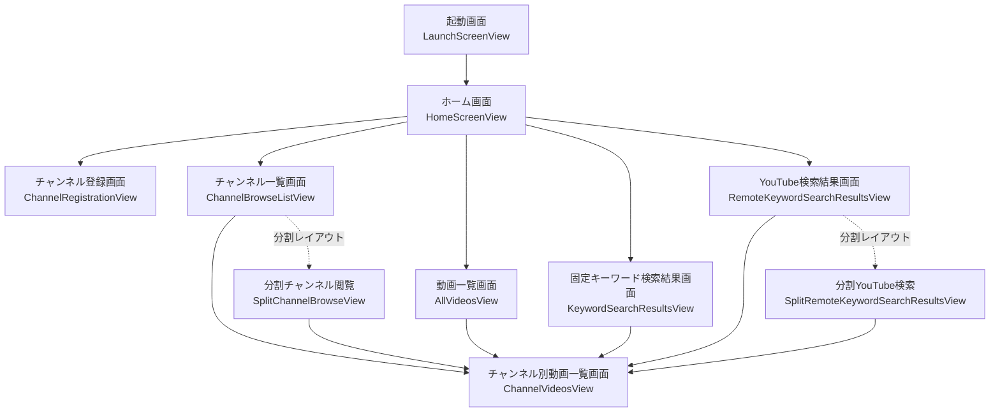

# HelloWorld GUI Reference

この文書は、画面への変更指示をしやすくするための GUI 設計資料です。機能要件の正本は [spec.md](spec.md)、上位方針の正本は [rules.md](rules.md)、実装責務の正本は [architecture.md](architecture.md) とし、本書はそれらを画面名、GUI パーツ名、画面遷移の観点で整理した参照資料として継続管理します。

## 画面遷移

## 共通パーツ

| 指示用の呼び名 | 実装名 | 用途 |
| --- | --- | --- |
| 画面タイトル行 | `InteractiveListScreen` の `title` | 一覧系画面の大見出し |
| 画面サブタイトル行 | `InteractiveListScreen` の `subtitle` | 一覧系画面の説明文 |
| 導線タイル | `MetricTile` | ホーム画面や空状態で使う角丸タイル |
| システム状況タイル | `SystemStatusTile` | ホーム画面の非操作情報タイル |
| チャンネル Tips タイル | `ChannelBrowseTipsTile` | チャンネル一覧先頭の非操作タイル |
| チャンネルヒーロータイル | `ChannelHeroTile` | 単独画面のチャンネル一覧タイル |
| チャンネル選択タイル | `ChannelSelectionTile` | 分割レイアウト左ペインのチャンネル一覧タイル |
| 動画ヒーロータイル | `VideoHeroTile` | 動画タイル本体 |
| 長押し動画タイル | `LongPressVideoTile` | タップ遷移と長押しメニューを持つ動画タイル |
| 下部結果チップ | `SearchResultCountChip` | 検索結果画面下部の件数・時刻チップ |
| 番号バッジ | `TileIndexBadge` | タイル右上の番号表示 |
| 右下情報バッジ | `VideoDebugBadge` | `No : 再生時間 再生数 (M/L)` 表示 |

## 画面一覧

### 1. 起動画面

- 画面名: `起動画面`
- 実装: `LaunchScreenView`
- 主な表示:
  - アプリ名 `HelloWorld`
  - 補助文言 `Launching...`
- 遷移:
  - 軽量キャッシュ読込完了後に `ホーム画面` へ進む

### 2. ホーム画面

- 画面名: `ホーム画面`
- 実装: `HomeScreenView`
- 画面識別:
  - タイトル識別子 `screen.home`
- 主な GUI パーツ:

| 指示用の呼び名 | 実装/識別子 | 役割 |
| --- | --- | --- |
| ホーム見出し | `Text("ホーム")` / `screen.home` | 画面タイトル |
| チャンネルタイル | `MetricTile` / `nav.channels` | 並び順を選んでチャンネル一覧へ |
| 動画タイル | `MetricTile` / `nav.videos` | 動画一覧へ |
| キャッシュ検索タイル | `MetricTile` / `nav.search` | 固定キーワード検索結果へ |
| YouTube検索タイル | `MetricTile` / `nav.remoteSearch` | YouTube検索結果へ |
| チャンネル登録タイル | `MetricTile` / `nav.channelRegistration` | チャンネル登録画面へ |
| バックアップタイル | `MetricTile` / `nav.registryTransfer` | 書き出し・読み込みメニュー |
| 全設定リセットタイル | `MetricTile` / `nav.resetAllSettings` | リセット確認ダイアログを開く |
| システム状況タイル | `SystemStatusTile` / `home.systemStatus` | 登録件数や API 設定状態を表示 |
| バックアップ結果カード | `home.transferFeedback` | 書き出し・読み込み成功時の結果 |
| リセット結果カード | `home.resetFeedback` | 全設定リセット結果 |
| バックアップ失敗カード | `home.transferError` | バックアップ失敗理由 |

- 操作:
  - 画面全体の pull-to-refresh で手動更新
  - `チャンネル` と `バックアップ` は `Menu`
  - `全設定リセット` は確認ダイアログ経由

### 3. チャンネル登録画面

- 画面名: `チャンネル登録画面`
- 実装: `ChannelRegistrationView`
- 主な GUI パーツ:

| 指示用の呼び名 | 実装/識別子 | 役割 |
| --- | --- | --- |
| 入力欄 | `TextField` / `channelRegistration.input` | `Channel ID`、`@handle`、URL を入力 |
| エラー表示 | `channelRegistration.error` | 失敗理由を表示 |
| 登録結果カード | `channelRegistration.feedback` | 登録済み/新規登録の結果を表示 |
| 追加ボタン | `channelRegistration.submit` | 解決と追加を実行 |

- 遷移:
  - 登録完了後も同画面に留まり、結果カードでフィードバックする

### 4. チャンネル一覧画面

- 画面名: `チャンネル一覧画面`
- 実装:
  - 単独画面 `ChannelBrowseListView`
  - 分割画面 `SplitChannelBrowseView`
- 主な GUI パーツ:

| 指示用の呼び名 | 実装/識別子 | 役割 |
| --- | --- | --- |
| 一覧タイトル | `InteractiveListScreen` の `title` | `チャンネル一覧` |
| 並び順サブタイトル | `sortDescriptor.listSubtitle` | 現在の並び順説明 |
| Tips タイル | `ChannelBrowseTipsTile` | 件数、並び順、基本操作 |
| チャンネルタイル | `ChannelHeroTile` / `channel.tile.<channelID>` | 単独画面のチャンネル一覧項目 |
| 分割チャンネルタイル | `ChannelSelectionTile` / `channel.tile.<channelID>` | 分割画面左ペインの選択項目 |
| 削除確認ダイアログ | `confirmationDialog` | `チャンネルを削除` を確認 |
| 削除結果アラート | `alert` | 削除結果を表示 |

- 操作と遷移:
  - タップで `チャンネル別動画一覧画面`
  - 長押しメニューで `チャンネルを削除`
  - 分割画面では左ペイン選択で右ペインだけ更新

### 5. チャンネル別動画一覧画面

- 画面名: `チャンネル別動画一覧画面`
- 実装: `ChannelVideosView`
- 主な GUI パーツ:

| 指示用の呼び名 | 実装/識別子 | 役割 |
| --- | --- | --- |
| 画面タイトル | `channelTitle` | チャンネル名を表示 |
| 動画タイル | `LongPressVideoTile` / `video.tile.<videoID>` | 動画一覧項目 |
| 空状態タイル | `MetricTile` | キャッシュ未取得時の案内 |
| 削除確認ダイアログ | `confirmationDialog` | チャンネル削除の確認 |
| 削除結果アラート | `alert` | 削除後に一覧から戻ることがある |
| 読込完了マーカー | `screen.channelVideos.loaded` | UI テスト用 |

- 操作と遷移:
  - pull-to-refresh で選択中チャンネルだけ強制更新
  - 動画タイル長押しで `YouTubeで開く` または `チャンネルを削除`

### 6. 動画一覧画面

- 画面名: `動画一覧画面`
- 実装: `AllVideosView`
- 主な GUI パーツ:

| 指示用の呼び名 | 実装/識別子 | 役割 |
| --- | --- | --- |
| 画面タイトル | `InteractiveListScreen` の `title` | `動画一覧` |
| 動画タイル | `LongPressVideoTile` | 全動画一覧項目 |
| 空状態タイル | `MetricTile` | キャッシュ未取得時の案内 |
| 削除確認ダイアログ | `confirmationDialog` | チャンネル削除の確認 |
| 削除結果アラート | `alert` | 削除結果を表示 |

- 操作と遷移:
  - 動画タイルの通常タップで `チャンネル別動画一覧画面`
  - 動画タイル長押しで `チャンネルを削除`

### 7. 固定キーワード検索結果画面

- 画面名: `固定キーワード検索結果画面`
- 実装: `KeywordSearchResultsView`
- 主な GUI パーツ:

| 指示用の呼び名 | 実装/識別子 | 役割 |
| --- | --- | --- |
| 画面タイトル | `InteractiveListScreen` の `title` | `検索結果` |
| 結果動画タイル | `LongPressVideoTile` | 検索ヒットした動画 |
| 下部結果チップ | `SearchResultCountChip` / `search.resultChip` | 件数、更新時刻、検索元表示 |
| 空状態タイル | `MetricTile` | 0件時の案内 |

- 操作と遷移:
  - pull-to-refresh でキャッシュ検索再読込
  - 動画タイルの通常タップで `チャンネル別動画一覧画面`
  - スクロールやドラッグ開始で下部結果チップを閉じる

### 8. YouTube検索結果画面

- 画面名: `YouTube検索結果画面`
- 実装:
  - 単独画面 `RemoteKeywordSearchResultsView`
  - 分割画面 `SplitRemoteKeywordSearchResultsView`
- 主な GUI パーツ:

| 指示用の呼び名 | 実装/識別子 | 役割 |
| --- | --- | --- |
| 画面タイトル | `InteractiveListScreen` の `title` | `YouTube検索` |
| 結果動画タイル | `LongPressVideoTile` | API/キャッシュ検索結果 |
| 下部結果チップ | `SearchResultCountChip` / `search.resultChip` | 件数、更新時刻、検索元表示 |
| 履歴クリアボタン | `ToolbarItem` の `Button("クリア")` | 検索履歴をクリア |
| 空状態タイル | `MetricTile` | 未取得、0件、エラー時の案内 |
| 分割詳細タイトル | `screen.remoteSearchSplitTitle` | 分割画面右ペインのチャンネル名 |
| テスト用再検索トリガ | `UITestAsyncActionTrigger` / `test.remoteSearch.refresh` | UI テスト用 |

- 操作と遷移:
  - 画面表示だけでは検索しない
  - pull-to-refresh で YouTube API 検索
  - 動画タイルの通常タップで `チャンネル別動画一覧画面`
  - 分割画面では左ペインのタップで右ペインだけ更新
  - 最後の動画タイル表示で段階読込を進める

## 指示に使う命名ルール

- 画面を指す時は `ホーム画面`、`チャンネル一覧画面` のような日本語名を使う。
- パーツを指す時は `ホーム画面のYouTube検索タイル`、`チャンネル一覧画面のTipsタイル`、`YouTube検索結果画面の下部結果チップ` のように、`画面名 + パーツ名` で呼ぶ。
- 実装箇所まで指定したい時は、`実装名` を併記して `ホーム画面のYouTube検索タイル（MetricTile / nav.remoteSearch）` のように書く。
- 分割レイアウト固有の指示は `左ペイン`、`右ペイン` を明示して、必要なら `SplitChannelBrowseView` または `SplitRemoteKeywordSearchResultsView` を添える。
