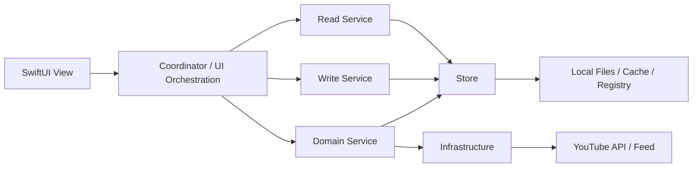
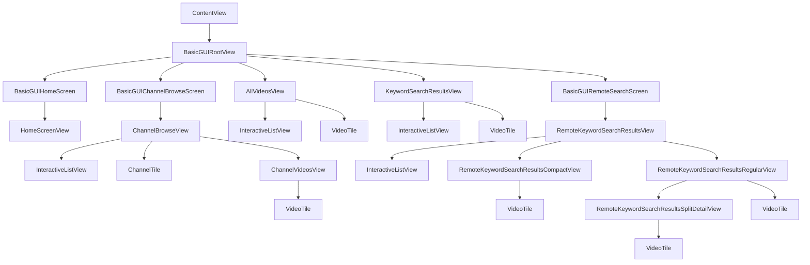
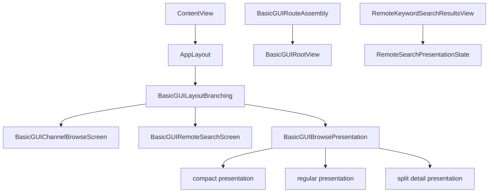
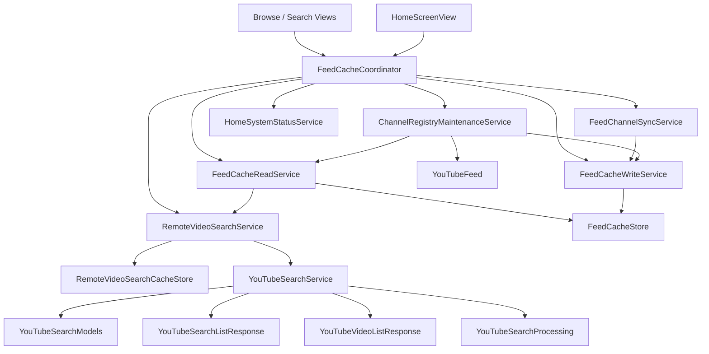
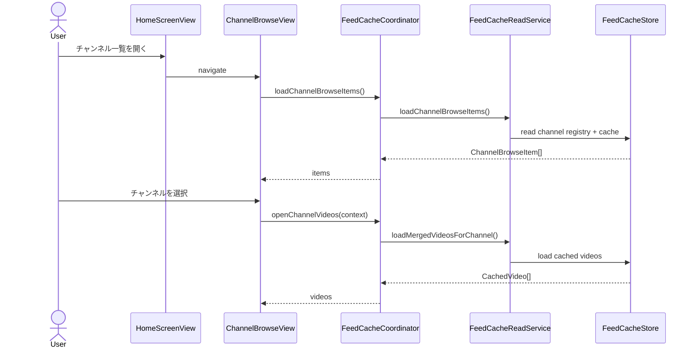
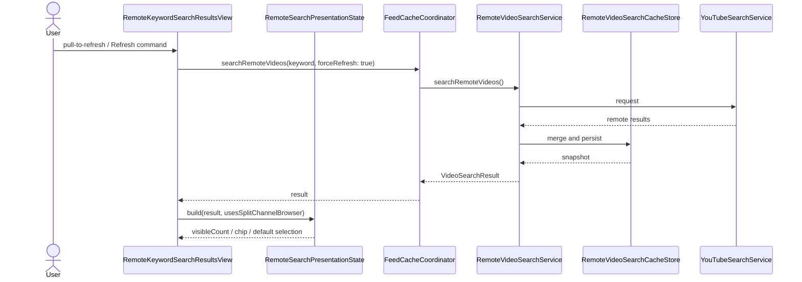

# YoutubeFeeder Design Overview

この文書は、人間のエンジニア向けに `AGENTS.md`、`specs-product.md`、`specs-architecture.md`、`specs-design.md` の内容を UML 風に読み替えた設計資料である。正本ではなく、関連する正本文書を人間が俯瞰しやすい形へ翻訳した `human-view` 文書として継続管理する。

文書群の役割分担は [AGENTS.md](../../AGENTS.md) と [specs.md](../specs.md) を参照する。

## レイヤ構成

## 主要構造図

### UI構造図（Viewツリー）

対象は `ContentView`、basic GUI の root / screen、各 SwiftUI View、共通 UI 部品の親子関係である。Coordinator、Service、Store、composition / pure logic の判断単位は含めない。

### 判断配置図（composition / pure logic）

対象は route / layout / presentation の決定位置である。SwiftUI View の親子関係、Coordinator から Service / Store へのデータフローは含めない。

composition は画面組み立てと判断の集約単位であり、UI クラスではない。View / Service / Store と同列の静的クラス依存として扱わず、どこで route、layout、presentation が決まるかを示す概念として扱う。

### データフロー図（View -> Coordinator -> Service -> Store / Infrastructure）

対象は View から `FeedCacheCoordinator` を経由して Service、Store、Infrastructure へ至る呼び出し関係とデータの流れである。View ツリー、route / layout / presentation の判断配置は含めない。

### classDiagram の扱い

`classDiagram` は Service / Store / Model の関係を確認する補助資料としてだけ使う。route / layout / UI orchestration は判断配置図で扱い、`classDiagram` を主説明にしない。

## 主要シーケンス

### ホームからチャンネル別動画一覧を開く

### YouTube検索の更新と表示

## 依存関係メモ

### UI構造メモ

- `ContentView` は launch 直後の入口として `BasicGUIRootView` を表示する。
- `BasicGUIRootView` は home、browse、all videos、keyword search、remote search の各 screen を束ねる。
- `InteractiveListView` は一覧系画面の共通コンテナとして使う。
- `VideoTile` と `ChannelTile` は一覧内の共通表示部品として使う。
- `HomeScreenView` はホーム表示中に hidden host として `BasicGUIRemoteSearchScreen` を prewarm する。

### 判断配置メモ

- `BasicGUIRouteAssembly` は basic GUI の route mapping を担う。
- `AppLayout` は regular 幅かどうかを基準に layout 判定を返す。
- `BasicGUILayoutBranching` は `AppLayout` の判定を browse 系 screen 向けの分岐へ写し替える。
- `BasicGUIBrowsePresentation` は browse 系画面の compact / regular / split detail presentation を決める。
- `RemoteSearchPresentationState` は YouTube 検索結果の visibleCount、chip 状態、split 初期選択を pure logic としてまとめる。
- `View` は `iPhone` / `iPad` / `Mac` の操作差分を UI 層で吸収する。

### データフローメモ

- `View` は I/O を直接持たず、`FeedCacheCoordinator` 経由で状態と操作を受ける。
- `View` は `refreshFeed()` やメニュー起動のようなドメインアクションを呼ぶ UI アダプタとして振る舞う。
- `FeedCacheCoordinator` は画面オーケストレーションを担い、読取り・書込み・同期・検索・ホーム状況集計を専用 service へ委譲する。
- `FeedCacheReadService` はキャッシュ読取り、動画検索、チャンネル動画マージをまとめる。
- `FeedCacheWriteService` はキャッシュ保存、サムネイル保存、bootstrap 永続化、整合性メンテナンスの入口を担う。
- `RemoteKeywordSearchResultsView` は state orchestration を持ち、compact / regular / split detail の表示本体は別 View へ分けて扱う。
- `YouTubeSearchService` は API 呼び出しと error handling を担い、公開 model、decode DTO、結果整列 helper は別ファイルへ分けて扱う。

### 同期メモ

- 正本を更新した時は、本書の主要構造図、主要シーケンスも同じ変更セットで同期する。
