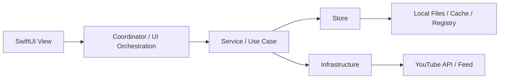
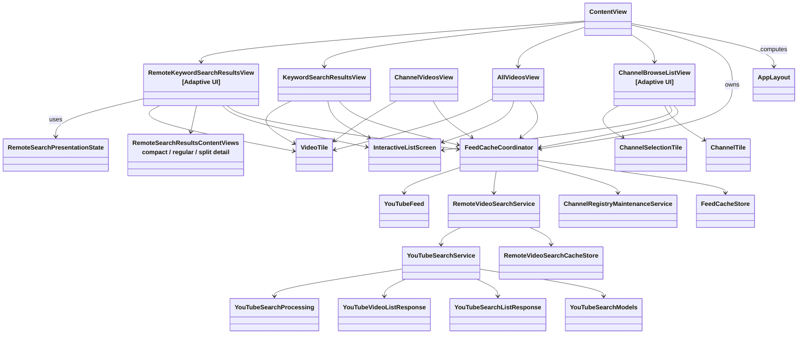
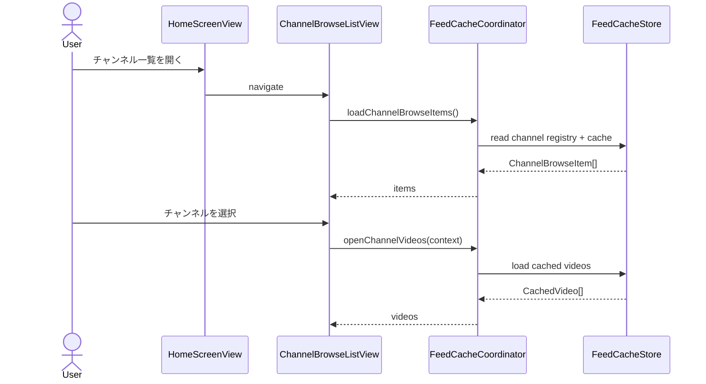
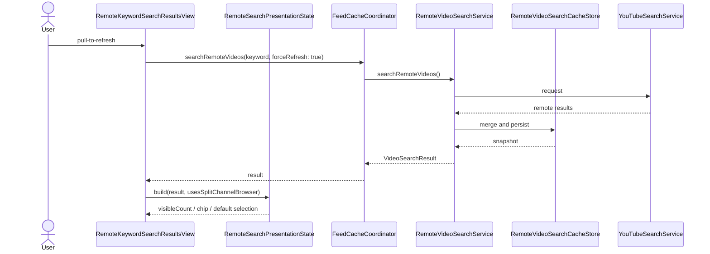

# YoutubeFeeder Design Overview

この文書は、人間のエンジニア向けに `rules.md`、`spec.md`、`architecture.md`、`design.md` の内容を UML 風に読み替えた設計資料である。正本ではなく、関連する正本文書を人間が俯瞰しやすい形へ翻訳した `human-view` 文書として継続管理する。

文書群の役割分担と文書運用ルールは [rules-document.md](../rules-document.md) を参照する。

## レイヤ構成

## 主要クラス図

## 主要シーケンス

### ホームからチャンネル別動画一覧を開く

### YouTube検索の更新と表示

## 依存関係メモ

- `View` は I/O を直接持たず、`FeedCacheCoordinator` 経由で状態と操作を受ける。
- `AppLayout` は adaptive 判定を持つが、機能差分は持たない。
- クラス枠内に `[Adaptive UI]` を付けた View は、内部に `CompactView` / `RegularView` の表現差分を持つが、資料上は 1 つの機能 View として扱う。
- `RemoteSearchPresentationState` は YouTube 検索結果の UI 状態を pure logic として切り出す。
- `RemoteKeywordSearchResultsView` は state orchestration を持ち、compact / regular / split detail の表示本体は `RemoteSearchResultsContentViews` へ分けて扱う。
- `YouTubeSearchService` は API 呼び出しと error handling を担い、公開 model、decode DTO、結果整列 helper は別ファイルへ分けて扱う。
- 正本を更新した時は、本書のクラス図、シーケンス図も同じ変更セットで同期する。
