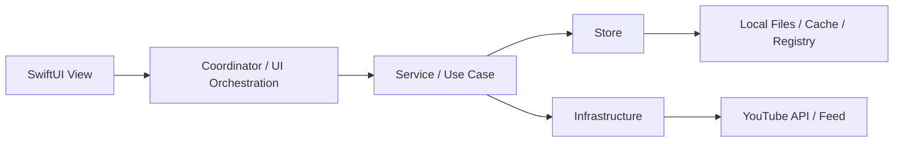
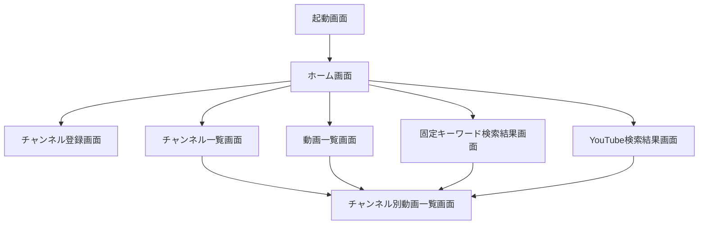
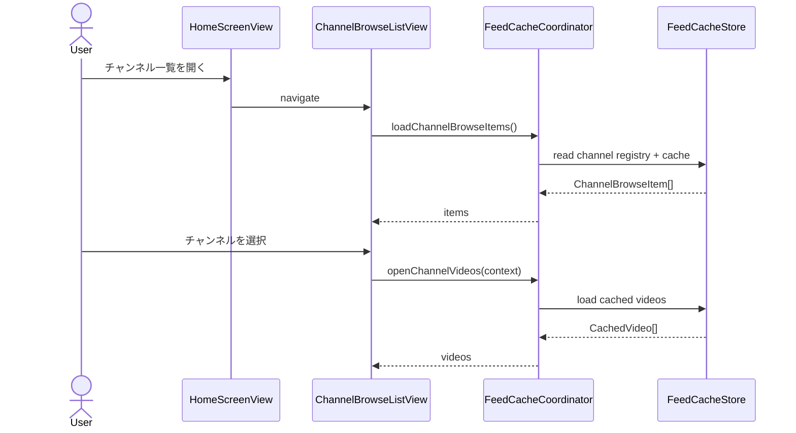
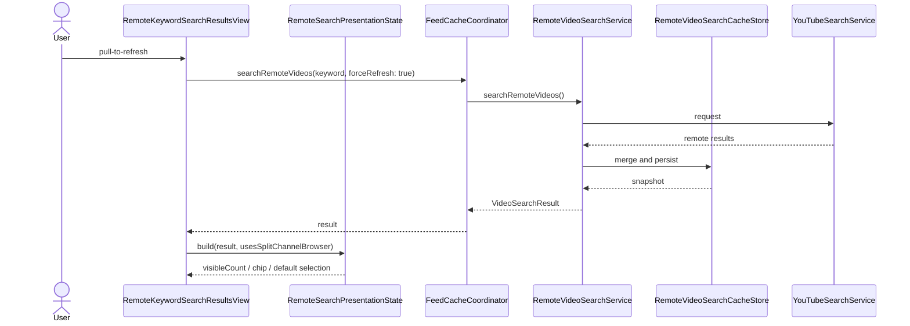

# HelloWorld Engineering Design

この文書は、人間のエンジニア向けに `rules.md`、`spec.md`、`architecture.md` の内容を UML 風に読み替えた設計資料です。正本ではありません。正本との差分を作らないため、機能変更や責務変更のたびに本書も同期します。

## 読み方

- 機能要件の正本: [../spec.md](../spec.md)
- 上位方針の正本: [../rules.md](../rules.md)
- 実装責務の正本: [../architecture.md](../architecture.md)
- GUI の人間向け参照: [gui-reference.md](gui-reference.md)

## レイヤ構成

## 主要クラス図

```mermaid
classDiagram
    class ContentView
    class AppLayout
    class FeedCacheCoordinator
    class ChannelBrowseListView
    class ChannelBrowseListCompactView
    class ChannelBrowseListRegularView
    class ChannelVideosView
    class AllVideosView
    class KeywordSearchResultsView
    class RemoteKeywordSearchResultsView
    class RemoteKeywordSearchResultsCompactView
    class RemoteKeywordSearchResultsRegularView
    class InteractiveListScreen
    class ChannelTile
    class ChannelSelectionTile
    class VideoTile
    class FeedCacheStore
    class ChannelRegistryMaintenanceService
    class RemoteVideoSearchService
    class RemoteVideoSearchCacheStore
    class YouTubeFeed
    class YouTubeSearchService
    class RemoteSearchPresentationState

    ContentView --> AppLayout : computes
    ContentView --> FeedCacheCoordinator : owns
    ContentView --> ChannelBrowseListView
    ContentView --> AllVideosView
    ContentView --> KeywordSearchResultsView
    ContentView --> RemoteKeywordSearchResultsView

    ChannelBrowseListView --> ChannelBrowseListCompactView : compact
    ChannelBrowseListView --> ChannelBrowseListRegularView : regular
    RemoteKeywordSearchResultsView --> RemoteKeywordSearchResultsCompactView : compact
    RemoteKeywordSearchResultsView --> RemoteKeywordSearchResultsRegularView : regular

    ChannelBrowseListView --> FeedCacheCoordinator
    ChannelVideosView --> FeedCacheCoordinator
    AllVideosView --> FeedCacheCoordinator
    KeywordSearchResultsView --> FeedCacheCoordinator
    RemoteKeywordSearchResultsView --> FeedCacheCoordinator

    ChannelBrowseListCompactView --> InteractiveListScreen
    RemoteKeywordSearchResultsCompactView --> InteractiveListScreen
    AllVideosView --> InteractiveListScreen
    KeywordSearchResultsView --> InteractiveListScreen
    ChannelVideosView --> VideoTile
    AllVideosView --> VideoTile
    KeywordSearchResultsView --> VideoTile
    RemoteKeywordSearchResultsCompactView --> VideoTile
    RemoteKeywordSearchResultsRegularView --> VideoTile
    ChannelBrowseListCompactView --> ChannelTile
    ChannelBrowseListRegularView --> ChannelSelectionTile

    FeedCacheCoordinator --> FeedCacheStore
    FeedCacheCoordinator --> ChannelRegistryMaintenanceService
    FeedCacheCoordinator --> RemoteVideoSearchService
    RemoteVideoSearchService --> RemoteVideoSearchCacheStore
    RemoteVideoSearchService --> YouTubeSearchService
    FeedCacheCoordinator --> YouTubeFeed

    RemoteKeywordSearchResultsView --> RemoteSearchPresentationState : uses
```

## 画面遷移図

## 主要シーケンス

### ホームからチャンネル別動画一覧を開く

### YouTube検索の更新と表示

## 依存関係メモ

- `View` は I/O を直接持たず、`FeedCacheCoordinator` 経由で状態と操作を受ける。
- `AppLayout` は adaptive 判定を持つが、機能差分は持たない。
- `CompactView` / `RegularView` は同一機能の表現差分であり、別機能画面ではない。
- `RemoteSearchPresentationState` は YouTube 検索結果の UI 状態を pure logic として切り出す。
- 正本を更新した時は、本書のクラス図、遷移図、シーケンス図も同じ変更セットで同期する。
