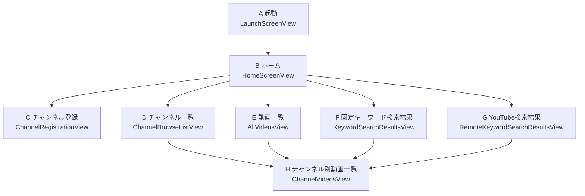

# HelloWorld GUI Reference

この文書は、人間の開発者が画面への変更指示をしやすくするための GUI 設計資料である。正本ではなく、関連する正本文書を人間が読みやすい形へ翻訳した `human-view` 文書として継続管理する。

文書群の役割分担と文書運用ルールは [rules-documents.md](../rules-documents.md) を参照する。

## 画面遷移

## 画面一覧

### 目次

- [画面A. 起動画面](#screen-a)
- [画面B. ホーム画面](#screen-b)
- [画面C. チャンネル登録画面](#screen-c)
- [画面D. チャンネル一覧画面](#screen-d)
- [画面E. 動画一覧画面](#screen-e)
- [画面F. 固定キーワード検索結果画面](#screen-f)
- [画面G. YouTube検索結果画面](#screen-g)
- [画面H. チャンネル別動画一覧画面](#screen-h)

### 画面A. 起動画面

- 画面名: `起動画面`
- 実装: `LaunchScreenView`
- 主な表示:
  - アプリ名 `HelloWorld`
  - 補助文言 `Launching...`
- 遷移:
  - 軽量キャッシュ読込完了後に `ホーム画面` へ進む

### 画面B. ホーム画面

- 画面名: `ホーム画面`
- 実装: `HomeScreenView`
- 画面識別:
  - タイトル識別子 `screen.home`
- 主な GUI パーツ:

| 指示用の呼び名 | 実装/識別子 | 役割 |
| --- | --- | --- |
| タイトル | `Text("ホーム")` / `screen.home` | 画面タイトル |
| チャンネルタイル | `MetricTile` / `nav.channels` | 並び順を選んでチャンネル一覧へ |
| 動画タイル | `MetricTile` / `nav.videos` | 動画一覧へ |
| キャッシュ検索タイル | `MetricTile` / `nav.search` | 固定キーワード検索結果へ |
| YouTube検索タイル | `MetricTile` / `nav.remoteSearch` | YouTube検索結果へ |
| チャンネル登録タイル | `MetricTile` / `nav.channelRegistration` | チャンネル登録画面へ |
| バックアップタイル | `MetricTile` / `nav.registryTransfer` | 書き出し・読み込みメニュー |
| 全設定リセットタイル | `MetricTile` / `nav.resetAllSettings` | リセット確認ダイアログを開く |
| システム状況タイル | `SystemStatusTile` / `home.systemStatus` | 登録件数や API 設定状態を表示 |
| バックアップ結果カード | `home.transferFeedback` | 書き出し・読み込み成功時の結果 |
| リセット結果カード | `home.resetFeedback` | 全設定リセット結果 |
| バックアップ失敗カード | `home.transferError` | バックアップ失敗理由 |

- 操作:
  - 画面全体の pull-to-refresh で手動更新
  - `チャンネル` と `バックアップ` は `Menu`
  - `全設定リセット` は確認ダイアログ経由

### 画面C. チャンネル登録画面

- 画面名: `チャンネル登録画面`
- 実装: `ChannelRegistrationView`
- 主な GUI パーツ:

| 指示用の呼び名 | 実装/識別子 | 役割 |
| --- | --- | --- |
| 入力欄 | `TextField` / `channelRegistration.input` | `Channel ID`、`@handle`、URL を入力 |
| エラー表示 | `channelRegistration.error` | 失敗理由を表示 |
| 結果カード | `channelRegistration.feedback` | 登録済み/新規登録の結果を表示 |
| 追加ボタン | `channelRegistration.submit` | 解決と追加を実行 |

- 遷移:
  - 登録完了後も同画面に留まり、結果カードでフィードバックする

### 画面D. チャンネル一覧画面

- 画面名: `チャンネル一覧画面`
- 実装: `ChannelBrowseListView`
- 主な GUI パーツ:

| 指示用の呼び名 | 実装/識別子 | 役割 |
| --- | --- | --- |
| タイトル | `InteractiveListScreen` の `title` | `チャンネル一覧` |
| サブタイトル | `sortDescriptor.listSubtitle` | 現在の並び順説明 |
| Tips タイル | `ChannelBrowseTipsTile` | 件数、並び順、基本操作 |
| チャンネルタイル | `ChannelTile` / `channel.tile.<channelID>` | 単独画面のチャンネル一覧項目 |
| 左ペインチャンネルタイル | `ChannelSelectionTile` / `channel.tile.<channelID>` | regular 幅の左ペイン選択項目 |
| 削除確認ダイアログ | `confirmationDialog` | `チャンネルを削除` を確認 |
| 削除結果アラート | `alert` | 削除結果を表示 |

- 操作と遷移:
  - タップで `チャンネル別動画一覧画面`
  - 長押しメニューで `チャンネルを削除`
  - regular 幅では左ペイン選択で右ペインだけ更新
- 長押しメニュー:
  - チャンネルタイル: `チャンネルを削除`
  - 左ペインチャンネルタイル: `チャンネルを削除`

### 画面H. チャンネル別動画一覧画面

- 画面名: `チャンネル別動画一覧画面`
- 実装: `ChannelVideosView`
- 主な GUI パーツ:

| 指示用の呼び名 | 実装/識別子 | 役割 |
| --- | --- | --- |
| タイトル | `channelTitle` | チャンネル名を表示 |
| 自動読込スピナー | `ProgressView` / `channel.autoRefreshIndicator` | 検索結果経由の自動 feed 更新中を表示 |
| 動画タイル | `VideoTile` / `video.tile.<videoID>` | 動画一覧項目 |
| 空状態タイル | `MetricTile` | 動画が無い時の案内 |
| 削除確認ダイアログ | `confirmationDialog` | チャンネル削除の確認 |
| 削除結果アラート | `alert` | 削除後に一覧から戻ることがある |
| 読込完了マーカー | `screen.channelVideos.loaded` | UI テスト用 |

- 操作と遷移:
  - pull-to-refresh で選択中チャンネルだけ強制更新
  - 検索結果経由の自動読込中は、画面上部に読込スピナーを表示
  - 動画タイル長押しで `YouTubeで開く` または `チャンネルを削除`
- 長押しメニュー:
  - 動画タイル: `YouTubeで開く`、`チャンネルを削除`

### 画面E. 動画一覧画面

- 画面名: `動画一覧画面`
- 実装: `AllVideosView`
- 主な GUI パーツ:

| 指示用の呼び名 | 実装/識別子 | 役割 |
| --- | --- | --- |
| タイトル | `InteractiveListScreen` の `title` | `動画一覧` |
| サブタイトル | `InteractiveListScreen` の `subtitle` | 一覧の説明文 |
| 動画タイル | `VideoTile` | 全動画一覧項目 |
| 空状態タイル | `MetricTile` | 動画が無い時の案内 |
| 削除確認ダイアログ | `confirmationDialog` | チャンネル削除の確認 |
| 削除結果アラート | `alert` | 削除結果を表示 |

- 操作と遷移:
  - 動画タイルの通常タップで `チャンネル別動画一覧画面`
  - 動画タイル長押しで `チャンネルを削除`
- 長押しメニュー:
  - 動画タイル: `チャンネルを削除`

### 画面F. 固定キーワード検索結果画面

- 画面名: `固定キーワード検索結果画面`
- 実装: `KeywordSearchResultsView`
- 主な GUI パーツ:

| 指示用の呼び名 | 実装/識別子 | 役割 |
| --- | --- | --- |
| タイトル | `InteractiveListScreen` の `title` | `検索結果` |
| サブタイトル | `InteractiveListScreen` の `subtitle` | 一覧の説明文 |
| 動画タイル | `VideoTile` | 検索ヒットした動画 |
| チップ | `SearchResultCountChip` / `search.resultChip` | 件数、更新時刻、検索元表示 |
| 空状態タイル | `MetricTile` | 動画が無い時の案内 |

- 操作と遷移:
  - pull-to-refresh でキャッシュ検索再読込
  - 動画タイルの通常タップで `チャンネル別動画一覧画面`
  - スクロールやドラッグ開始でチップを閉じる
- 長押しメニュー:
  - 動画タイル: `未定義`

### 画面G. YouTube検索結果画面

- 画面名: `YouTube検索結果画面`
- 実装: `RemoteKeywordSearchResultsView`
- 主な GUI パーツ:

| 指示用の呼び名 | 実装/識別子 | 役割 |
| --- | --- | --- |
| タイトル | `InteractiveListScreen` の `title` | `YouTube検索` |
| サブタイトル | `InteractiveListScreen` の `subtitle` | 一覧の説明文 |
| 動画タイル | `VideoTile` | API/キャッシュ検索結果 |
| チップ | `SearchResultCountChip` / `search.resultChip` | 件数、更新時刻、検索元表示 |
| 履歴クリアボタン | `ToolbarItem` の `Button("クリア")` | 検索履歴をクリア |
| 空状態タイル | `MetricTile` | 未取得、0件、エラー時の案内 |
| 右ペインタイトル | `screen.remoteSearchSplitTitle` | regular 幅の右ペインのチャンネル名 |
| テスト用再検索トリガ | `UITestAsyncActionTrigger` / `test.remoteSearch.refresh` | UI テスト用 |

- 操作と遷移:
  - 画面表示だけでは検索しない
  - pull-to-refresh で YouTube API 検索
  - 再検索中はチップを `再検索中` 表示へ切り替え、前回結果の要約を一時的に隠す
  - 動画タイルの通常タップで `チャンネル別動画一覧画面`
  - regular 幅では左ペインのタップで右ペインだけ更新
  - 最後の動画タイル表示で段階読込を進める
- 長押しメニュー:
  - 動画タイル: `未定義`
  - 右ペインの動画タイル: `YouTubeで開く`

## 指示に使う命名ルール

- 画面を指す時は `ホーム画面`、`チャンネル一覧画面` のような日本語名に加え、`画面A`、`画面G` のようなアルファベット付き短縮名も使える。
- パーツを指す時は `ホーム画面のYouTube検索タイル`、`チャンネル一覧画面のTipsタイル`、`YouTube検索結果画面のチップ` のように、`画面名 + パーツ名` で呼ぶ。
- 同じ役割のパーツは画面をまたいでも同じ名前を使う。たとえば `動画タイル`、`空状態タイル`、`タイトル`、`サブタイトル` は画面ごとに言い換えない。
- その画面内で重複しない場合は、`チャンネル別動画一覧画面のタイトル` のように短い名前を優先する。
- 画面識別を短くしたい場合は、`画面Gのチップ`、`画面DのTipsタイル` のように `画面アルファベット + パーツ名` で指定してよい。
- 実装箇所まで指定したい時は、`実装名` を併記して `ホーム画面のYouTube検索タイル（MetricTile / nav.remoteSearch）` のように書く。
- regular 幅固有の指示は `左ペイン`、`右ペイン` を明示し、必要なら親の機能画面名を添える。
