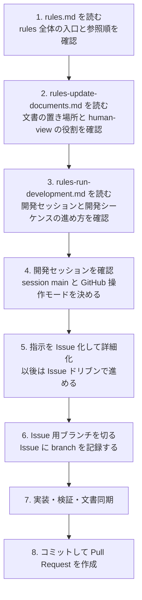
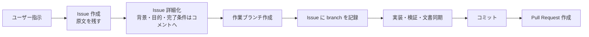

# YoutubeFeeder Rules Overview

この文書は、人間の開発者が `rules` コレクションを上から順に読み進めて、開発セッションと開発シーケンスの流れを短時間でつかむための overview である。正本ではなく、[rules.md](../rules.md)、[rules-update-documents.md](../rules/rules-update-documents.md)、[rules-run-development.md](../rules/rules-run-development.md) を人間向けに読み替えた `human-view` 文書として扱う。

細かな例外条件、厳密な禁止事項、運用の詳細は正本を参照し、この文書には全体像と読む順番だけを残す。

## まず全体像

## 先に覚える 2 つの単位

| 単位 | 何を指すか | 人間が最初に意識すること |
| --- | --- | --- |
| 開発セッション | 同じ基準ブランチと GitHub 操作モードで続ける作業期間 | 今回はどの branch を `session main` として使うか |
| 開発シーケンス | 1 件の指示から始まり、Issue 化、実装、検証、文書同期、コミット、PR 作成まで進む 1 周 | 1 指示ごとに 1 本の Issue ドリブン作業として完了まで運ぶこと |

人間向けには、`開発セッション` が「作業の土台」、`開発シーケンス` が「1 件の依頼を完了させる流れ」と考えると読みやすい。

## セッション開始時にやること

1. [rules.md](../rules.md) を入口として読む。
2. [rules-update-documents.md](../rules/rules-update-documents.md) で、今回の変更をどこへ書くべきか確認する。
3. [rules-run-development.md](../rules/rules-run-development.md) で、今回の開発シーケンスの進め方を確認する。
4. `llm-cache/session-context.json` を見て、現在の `session main` と `operationMode` を確認する。
5. 新しいセッションなら、現在の branch をそのまま基準ブランチとして使うかを決める。

この段階の目的は、「どの branch を基準にするか」と「この依頼をどの正本文書に基づいて進めるか」を先に固めることにある。

## 1 件の開発シーケンスを上から追う

| 順番 | やること | この段階で人間が見るもの | 主な成果物 |
| --- | --- | --- | --- |
| 1 | 履歴とセッション情報を確認する | `llm-cache/session-context.json`、必要なら `history/*-latest.md` | 今回の基準 branch と mode が分かる |
| 2 | 指示を理解する | ユーザー指示、関連する rules / specs | 影響範囲の見立て |
| 3 | Issue を作って詳細化する | GitHub Issue | 原文、ToDo、詳細化コメント |
| 4 | 作業ブランチを作る | Issue と branch | Issue に記録された branch |
| 5 | 先行テストで期待を固定する | テストコード、仕様 | 失敗で再現する期待 |
| 6 | 実装と健康度点検を進める | 実装コード、関連文書 | 変更本体 |
| 7 | 検証する | build / test / scripts | `error 0`、`warning 0` を目指す確認結果 |
| 8 | 文書を同期する | 正本文書、`human-view`、履歴文書 | ずれのない文書更新 |
| 9 | コミットする | Git 履歴 | 変更単位が追える日本語コミット |
| 10 | Pull Request を作る | GitHub Pull Request | Issue とつながった提出物 |

## Issue ドリブンで見るべき流れ

- チャット起点の依頼でも、まず Issue を作ってから着手する。
- Description は「原文と ToDo」、詳細な整理は Issue コメント、という役割分担で読む。
- 実装は基準ブランチへ直接積まず、必ず Issue 用ブランチで進める。
- 完了時は Issue、branch、commit、Pull Request の対応が追える状態にする。

## 文書更新の見方

- `rules.md` は入口と参照順だけを見る文書として読む。
- `rules-update-documents.md` は「どこへ書くべきか」を判断する時に開く。
- `rules-run-development.md` は「どう進めるか」を判断する時に開く。
- `docs/human-view/` は正本ではなく、人間が素早く理解するための翻訳資料として使う。

今回のように overview を追加する時は、`human-view` にしか存在しない新しい判断基準を作らず、正本への導線を見やすく整理することが重要になる。

## この overview だけで足りない時の参照先

| 知りたいこと | 参照先 |
| --- | --- |
| rules コレクション全体の入口、参照順、共通原則 | [rules.md](../rules.md) |
| 文書の置き場所、human-view の役割、Markdown 運用 | [rules-update-documents.md](../rules/rules-update-documents.md) |
| 開発セッション、Issue 駆動、検証、完了条件 | [rules-run-development.md](../rules/rules-run-development.md) |
| 画面呼称や GUI 変更指示の出し方 | [gui.md](./gui.md) |
| 実装構造や依存方向の俯瞰 | [design-overview.md](./design-overview.md) |

## 最後に見るチェック

- 上から読んで、今どの段階にいるか説明できるか。
- 「どこへ書くか」と「どう進めるか」を別文書として言い分けられるか。
- 詳細ルールが必要になった時に、overview ではなく正本へ戻れるか。

この 3 点ができれば、この overview の目的は果たせている。
