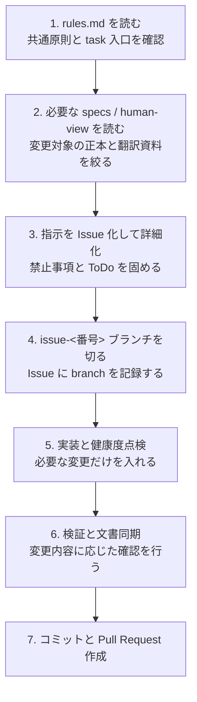
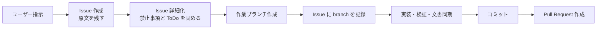

# YoutubeFeeder Rules Overview

この文書は、人間の開発者が `rules.md` と各 `skills/*.md` を読む前に、開発フローの全体像を短時間でつかむための overview である。正本ではなく、[rules.md](../rules.md) と [specs.md](../specs.md) を人間向けに読み替えた `human-view` 文書として扱う。

細かな例外条件、厳密な禁止事項、各タスクの実施手順は正本を参照し、この文書には全体像と読む順番だけを残す。

## まず全体像

## 先に覚える 2 つの見方

| 見方 | 何を指すか | 人間が最初に意識すること |
| --- | --- | --- |
| task 入口 | `rules.md` に並ぶ task 名と対応する `skills/*.md` | いまの依頼でどの skill を読む必要があるか |
| Issue ドリブン進行 | 1 件の指示を Issue 化し、詳細化、実装、検証、文書同期、コミット、PR まで運ぶ流れ | 1 指示を 1 本の Issue と branch に対応付けて追えるか |

## セッション開始時にやること

1. [rules.md](../rules.md) を入口として読む。
2. `セッション開始` task が必要なら `skills/session-start.md` を読み、`main` の最新化と `history-rotate` を完了する。
3. 今回の依頼で読むべき specs / human-view / code を最小限に絞る。
4. 依頼を継続実装するなら GitHub Issue を起点に進める。

この段階の目的は、「どの task を起動するか」と「この依頼をどの正本文書に基づいて進めるか」を先に固めることにある。

## 1 件の開発シーケンスを上から追う

| 順番 | やること | この段階で人間が見るもの | 主な成果物 |
| --- | --- | --- | --- |
| 1 | 指示を理解する | ユーザー指示、`rules.md`、必要な specs / code | 変更対象と読取り境界 |
| 2 | Issue を作って詳細化する | GitHub Issue | 原文、禁止事項、ToDo、詳細化コメント |
| 3 | 作業ブランチを作る | Issue と branch | `issue-<番号>` branch と記録 comment |
| 4 | 必要なら先行テストで期待を固定する | テストコード、仕様 | 失敗で再現する期待 |
| 5 | 実装と健康度点検を進める | 実装コード、関連文書 | 変更本体と健全性観測 |
| 6 | 検証する | build / test / scripts | `error 0`、`warning 0` を目指す確認結果 |
| 7 | 文書を同期する | 正本文書、`human-view` | ずれのない文書更新 |
| 8 | コミットする | Git 履歴 | 変更単位が追えるコミット |
| 9 | Pull Request を作る | GitHub Pull Request | Issue とつながった提出物 |

## Issue ドリブンで見るべき流れ

- チャット起点の依頼でも、まず Issue を作ってから着手する。
- Description は「禁止事項と ToDo」、詳細な整理は Issue コメント、という役割分担で読む。
- 実装は基準ブランチへ直接積まず、必ず Issue 用ブランチで進める。
- 完了時は Issue、branch、commit、Pull Request の対応が追える状態にする。

## 文書更新の見方

- `rules.md` は task の入口と参照順だけを見る文書として読む。
- `docs/specs/` は機能仕様、設計、環境の正本として読む。
- `docs/human-view/` は正本ではなく、人間が素早く理解するための翻訳資料として使う。
- 文書を更新する時は `skills/document-sync.md` を開き、正本と `human-view` の役割を混在させない。

overview を更新する時は、`human-view` にしか存在しない新しい判断基準を作らず、正本への導線を見やすく整理することが重要になる。

## この overview だけで足りない時の参照先

| 知りたいこと | 参照先 |
| --- | --- |
| task 入口、共通原則、どの skill を読むか | [rules.md](../rules.md) |
| specs コレクション全体の入口 | [specs.md](../specs.md) |
| 文書配置、`human-view` の扱い、Markdown 運用 | [document-sync.md](../../skills/document-sync.md) |
| 画面呼称や GUI 変更指示の出し方 | [gui.md](./gui.md) |
| 実装構造や依存方向の俯瞰 | [design-overview.md](./design-overview.md) |

## 最後に見るチェック

- 上から読んで、今どの段階にいるか説明できるか。
- どの task でどの skill を読むべきか説明できるか。
- 詳細ルールが必要になった時に、overview ではなく正本へ戻れるか。

この 3 点ができれば、この overview の目的は果たせている。
